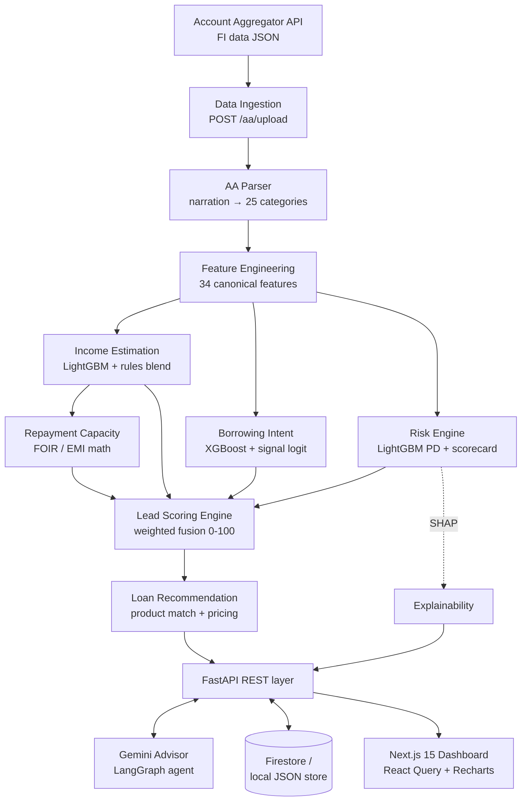
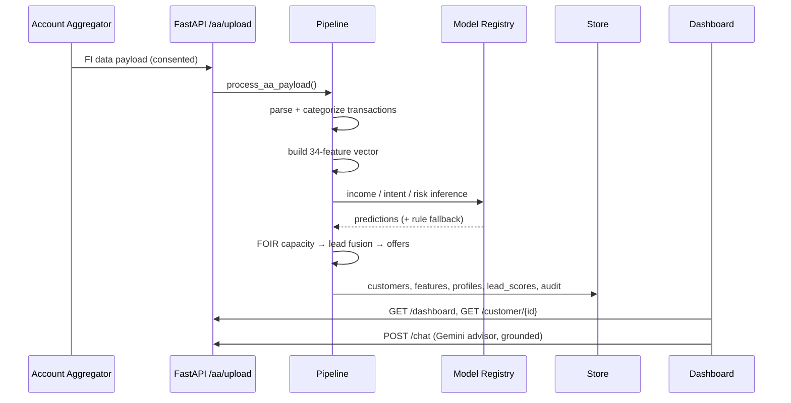

# LendIQ — System Architecture

## High-level architecture

## Scoring sequence (one customer)

## Layers

| Layer | Technology | Responsibility |
|---|---|---|
| Ingestion | FastAPI + Pydantic | Validate AA payloads, consent metadata |
| Intelligence | 6 engines (`backend/app/services/`) | Income, capacity, intent, risk, lead, offers |
| ML | LightGBM, XGBoost, SHAP (`ml/`) | Training, registry, drift detection |
| Agent | LangGraph (`agents/`) | fetch → classify → underwrite/advise → compose |
| Serving | Firestore / local JSON | Denormalized profile read-model |
| UX | Next.js 15, Tailwind, Recharts | Executive dashboard, profile, chat, what-if |

## Design decisions

1. **Rules + ML blend, never ML alone.** Every engine has a calibrated
   deterministic core; model artifacts sharpen it (60/40 blend). Missing
   artifacts degrade gracefully — the demo never breaks.
2. **One feature builder for training and serving** (`feature_engineering.py`)
   eliminates skew; the vector order is the model contract.
3. **Denormalized profile document** = single read per screen, ideal for
   Firestore pricing and sub-100ms dashboards.
4. **Hard policy guards over model scores** (FOIR cap 55%, grade-E cap):
   regulatory constraints must never be learned away.
5. **Offline-first demo**: no Gemini key → deterministic grounded advisor;
   no Firestore creds → local JSON store; same code paths.

## Scalability path (enterprise)

- Swap ingestion to Pub/Sub + Cloud Run workers; land raw transactions in
  BigQuery, keep Firestore as serving layer.
- Model registry → Vertex AI Model Registry; drift job (`ml/drift_detection.py`)
  on Cloud Scheduler; champion/challenger via traffic split.
- Add consent lifecycle service (AA FIU module) and PII tokenization before
  feature store; audit collection already provides the trail.
